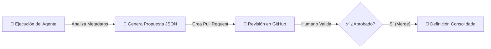

# 📘 Manual de Operación: Agente de Recomendación de Productos de Datos con IA

Este documento describe el flujo de trabajo completo para utilizar el Agente de IA que analiza metadatos de BigQuery y genera propuestas automáticas de **Productos de Datos** (Data Products) para su gobierno.

## 🔄 Flujo del Proceso

El proceso consta de 3 etapas principales:



---

## Prerequisitos

1. Activar el entorno virtual:
   ```bash
   .venv\Scripts\activate
   # O en Mac/Linux:
   source .venv/bin/activate
   ```
2. Instalar dependencias:
   ```bash
   pip install -r requirements.txt
   ```
3. Configurar credenciales de GCP (Application Default Credentials):
   ```bash
   gcloud auth application-default login
   ```
4. Configurar variables de entorno (ver `config/settings.py` o crear un `.env`).

### 1. 🚀 Ejecución del Agente (Recomendación)
El proceso comienza ejecutando el agente localmente o programado.

**Comando:**
```bash
python main.py
```

**Lo que hace el agente:**
1.  **Conecta a BigQuery** y lee los metadatos técnicos (tablas, esquemas, descripciones) del dataset objetivo.
2.  Envía este contexto a **Gemini 2.5 Flash**.
3.  Gemini analiza las relaciones semánticas y sugiere **Productos de Datos** lógicos, incluyendo:
    *   **Nombre** del producto.
    *   **Descripción** de negocio.
    *   **Dominio** sugerido (ej. Ventas, Logística).
    *   **Owner** propuesto.
    *   Lista de **tablas** que lo componen.
4.  Genera un archivo JSON local y abre una **Pull Request (PR)** en GitHub con la propuesta.

---

### 2. 📝 Revisión Humana (Gobierno)
Un Data Steward o Arquitecto de Datos recibe la notificación de la PR.

**Acciones:**
1.  Revisar el archivo JSON propuesto en la pestaña "Files changed".
2.  Evaluar si la agrupación de tablas tiene sentido para el negocio.
3.  Validar o corregir los campos de `domain` y `owner`.
4.  Si está conforme, hace clic en **"Merge pull request"**.

---

### 3. 📂 Consolidación
Al aprobar (hacer merge) la PR, la definición del Producto de Datos queda versionada y aprobada en el repositorio (`output/data_products_proposal_....json`).

*Nota: Actualmente este agente se centra en la **recomendación y diseño**. La implementación posterior de estos productos en Dataplex u otras herramientas se realiza basándose en estos archivos JSON aprobados.*

---

## 🛠️ Configuración Requerida

Para que este flujo funcione, se necesitan los siguientes secretos o configuraciones:

1.  `GCP_PROJECT_ID`: ID del proyecto de Google Cloud.
2.  `GCP_LOCATION`: Ubicación de los recursos (ej. `us-central1`).
3.  `GITHUB_TOKEN`: Token para crear Pull Requests (si se ejecuta en CI/CD o con el cliente de GitHub configurado).

---

## 💡 Preguntas Frecuentes

**¿Qué criterio usa el agente para agrupar tablas?**
El agente utiliza el modelo Gemini para inferir relaciones semánticas basándose en los nombres de las tablas, columnas y sus descripciones existentes en BigQuery.

**¿Puedo modificar la propuesta antes de aprobarla?**
Sí, puedes editar el archivo JSON directamente en la interfaz de GitHub (o en tu editor local antes de hacer push/merge) para ajustar nombres, owners o mover tablas entre productos.

**¿Cómo cambio el dataset a analizar?**
Edita la variable `TARGET_DATASET` en `config/settings.py` o mediante variables de entorno.
